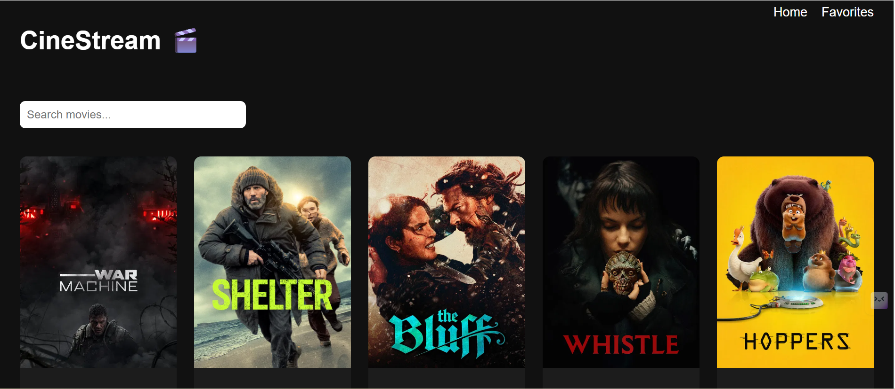
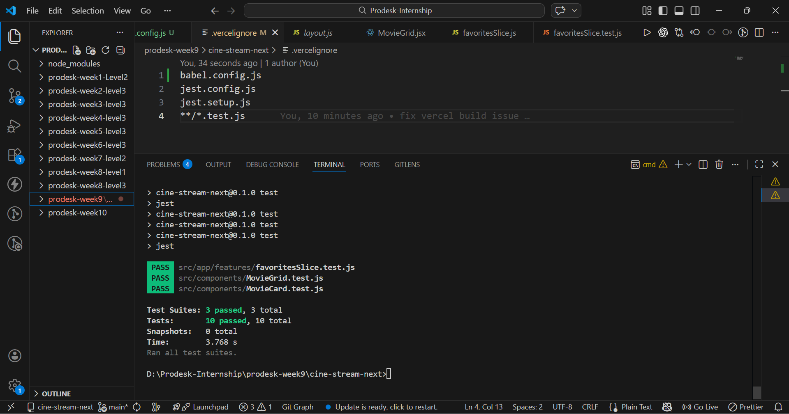
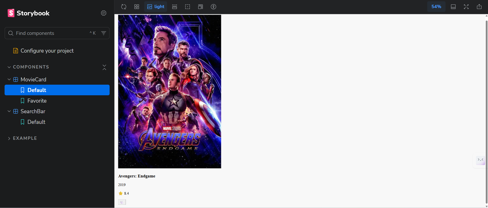

# week9-level3 project

👉 Live URL:https://cine-stream-next-kappa.vercel.app/


# week 10 UI image
📸 Screenshot


 # Week 10 Upgrade: level 3
- Redux Toolkit (Global State)
- Favorites System
- Search & Rating Filter
- Performance Optimization (useMemo)
- Dark/Light Theme

# week 11  testing : level 3

## week 11 UI image
📸 Screenshot


## 🎬 CineStream - Movie App with Testing


## 📌 Project Overview
CineStream is a movie browsing application built using Next.js and Redux Toolkit.  
In this project, I implemented unit and component testing using Jest and React Testing Library.

---

## 🚀 Features
- Browse movies
- Add/Remove favorites (Redux)
- Search and filter movies
- Responsive UI

---

## 🧪 Testing (Week 11 Task)
I implemented testing for:

### ✅ Component Testing
- MovieCard (UI rendering + interaction)
- MovieGrid (filtering logic)

### ✅ Redux Testing
- favoritesSlice (add/remove functionality)

---

## 🛠 Tech Stack
- Next.js
- React
- Redux Toolkit
- Jest
- React Testing Library

---

## 📦 Installation

```bash
npm install

# week 12  The Storybook Setup. : Level 3

## week 12 UI image
  📸 Screenshot


👉 Live URL: https://cine-stream-next-7qnz.vercel.app/?path=/story/components-moviecard--default

👨‍💻 Author
Dilkhush Kumar